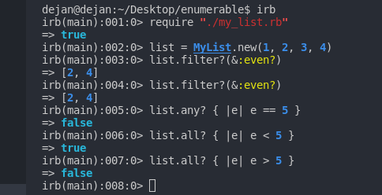

# Ruby Enumerable
## Created a module MyEnumerable that implements the following methods (they have the same functionality as methods in Enumerable):
- #all?
- #any?
- #filter

Each class and module has a separate .rb file.

## Screenshot

	
## Technologies
Project is created with:
* Ruby

 ## Setup
To run this project, install it locally using:
- cd Desktop
- git clone https://github.com/mugishasam123/enumerable.git
- irb
- require "./my_list.rb"
- list = MyList.new(1, 2, 3, 4)
- list.all? { |e| e < 5 }
- list.all? { |e| e > 5 }
- list.any? { |e| e == 2 }
- list.filter?(&:even?)

## Authors

👤 ** Mugisha Samuel**

- GitHub: [mugishasamuel](https://github.com/mugishasam123)
- LinkedIn: [mugishasamuel](https://www.linkedin.com/in/mugisha-samuel-55a905208/)

👤 **Dejan Vujovic**

- Github : [@VuDej](https://github.com/VuDej)
- Twitter: [@DejanVuj](https://twitter.com/DejanVuj)
- LinkedIn : [@Dejan-Vujovic](https://www.linkedin.com/in/dejan-vujovic-5a0672225/)
  
## 🤝 Contributing

Contributions, issues, and feature requests are welcome!

## Show your support

Give a ⭐️ if you like this project!

## Acknowledgments

- Hat tip to anyone whose code was used
- Inspiration
- etc

## 📝 License

This project is [MIT](https://opensource.org/licenses/MIT)) licensed.